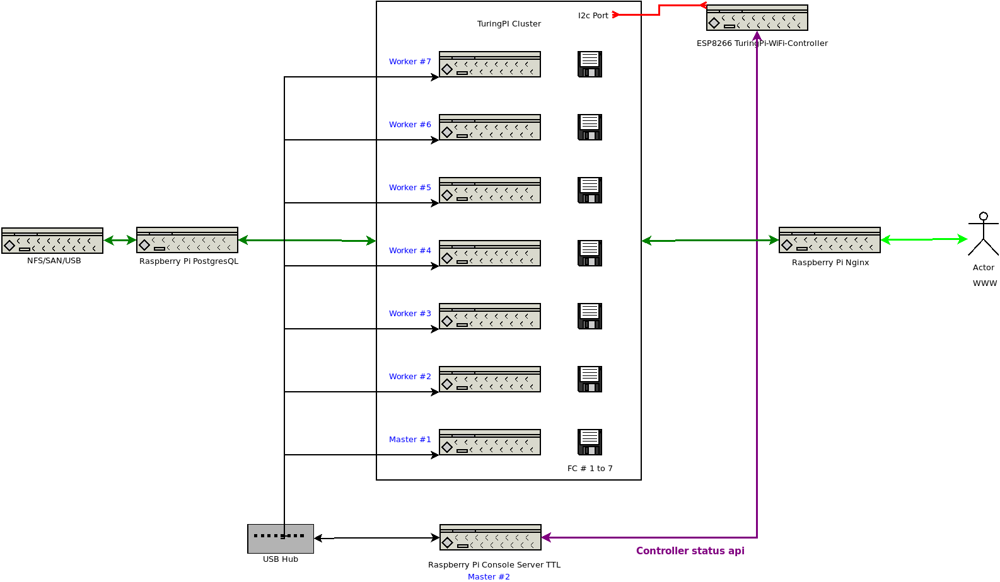

# Automaton for TP Cluster.
---
## Bash script to image and setup requierments for auto booting images on TPC
        
    image-flashcards.sh: linux shell script to install HypiorOS on cf cards and tune cloud-init for use with ansible
            
    argument help:
      image-flashcards.sh dev=/dev/sda image=hypriotos-rpi-v1.12.3.img ip=10.5.94.51 shortname=master-01 -F
      image-flashcards.sh dev=/dev/sda image=hypriotos-rpi-v1.12.3.img ip=10.5.94.51 shortname=master-01 -F --copy-cfg

      --debug #  debug
      -F #  force overwrite image to install fresh image
      -skip-dd # force skip dd image
      -copy-cfg #  copy configs only

      Arg: 1
      dev=/dev/sda #  cf card device
      
      image=os.img #  image file

      Arg: 3
      ip=10.5.94.51 # set fixed address

      Arg: 4
      shortname=master-01 # set hostname

---

## cloud-init and boot config file to review prior to boot image.

  - /boot/config.txt   # rpi boot config 
  - /boot/cmdline.txt  # rpi coot config
  - /boot/user-data    # cloud-init used by hypriot distribution

  review files here: roles/bootstrap-core/templates/ and roles/bootstrap-core/files/

  See user-data for prepopulating the deployment ssh keys.

## Ansible inventory:

    As the inventory was prepopulated by the imaging shell script.
    you can review the addresses found on the network.
```
      nmap -sn 10.5.94.1/24
```
    Each host should have a two ip addresses one static and one dhcped.
    The inventory must have two groups. "node", "master", and "k3s_cluster" to support k3s_cluster deployment correctly.

Ansible setup roles to simplify some prerequsists tasks:
    playbook: tpc_cluster-playbook.yml

      play #1 (all): Deploy TP Cluster for k3s Sturgeon Technologies  TAGS: []
        tasks:
          bootstrap-core : template /boot/user-data                                                         TAGS: [base, cloud-init-cfg]
          bootstrap-core : Copy config.txt to boot                                                          TAGS: [base, boot-config, kernel-tuning]
          bootstrap-core : Copy cmdline.txt to boot                                                         TAGS: [base, boot-cmdline, kernel-tuning]
          bootstrap-core : Set a hostname to:                                                               TAGS: [base, hostname]
          bootstrap-core : Set up multiple authorized keys                                                  TAGS: [base, sshkeys]
          bootstrap-core : Update repositories cache and install "i2c-tools" and "python-smbus" package     TAGS: [base, i2c-tools]
          bootstrap-core : Remove useless packages from the cache                                           TAGS: [apt-autoclean, base, make-release-deploy]
          bootstrap-core : Remove dependencies that are no longer required                                  TAGS: [apt-autoremove, base, make-release-deploy]
          bootstrap-core : Run the equivalent of "apt-get clean" as a separate step                         TAGS: [apt-clean, base, make-release-deploy]
          bootstrap-core : Add IP address of all hosts to all hosts                                         TAGS: [add_hosts, base]

---

## k3s and kubectl quick setup:

Run: k3s_cluster playbook
```
    cd k3s_cluster
    ansible-playbook -i ../hosts.yml k3s_cluster sites.yml
    scp pirate@master-01:~/.kube/config ~/.kube/config
    source .env 
    kubectl config view
    kubectl get nodes # Review that the k3s_cluster has registered the worker nodes 2 throw 7 correctly.

    # Expected output for working deployment
    NAME        STATUS                     ROLES                  AGE     VERSION
    master-01   Ready                      control-plane,master   3d12h   v1.22.3+k3s1
    worker-02   Ready,SchedulingDisabled   <none>                 179m    v1.22.3+k3s1 
    worker-03   Ready                      <none>                 179m    v1.22.3+k3s1
    worker-04   Ready                      <none>                 179m    v1.22.3+k3s1
    worker-05   Ready                      <none>                 179m    v1.22.3+k3s1
    worker-06   Ready                      <none>                 179m    v1.22.3+k3s1
    worker-07   Ready                      <none>                 142m    v1.22.3+k3s1
```

See branch k3s_ha for HA deployment on project k3s-ansible.

---
## Setting up ESP8266 TuringPi-WiFi-Controller for ping checking and api based node resetting.


---

---
## Notes:
  ### Projects:
   - https://docs.turingpi.com/
   - https://github.com/k3s-io/k3s-ansible 
   - https://github.com/thorsten-l/ESP8266-TuringPi-WiFi-Controller


  ### Reading:
  - https://kubernetes.io/docs/reference/kubectl/cheatsheet/
  - https://rancher.com/docs/k3s/latest/en/quick-start/
  - https://rancher.com/docs/k3s/latest/en/advanced
